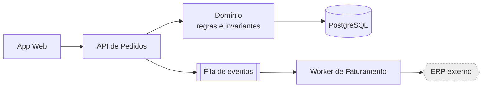
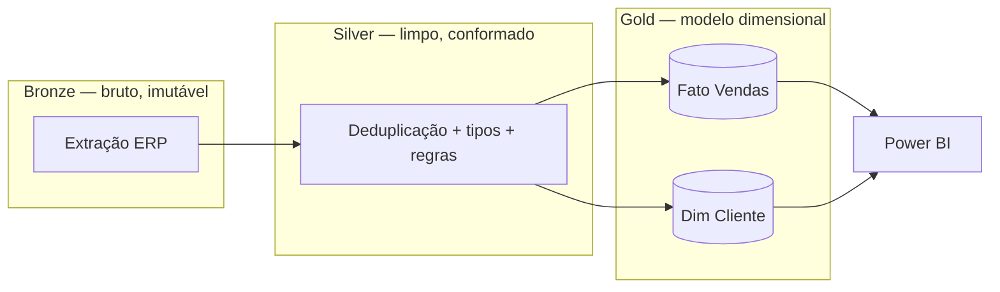

# 02 — Arquitetura

Desenhar, criticar e evoluir estrutura de sistema. Arquitetura é o conjunto de decisões caras de reverter — o resto é implementação.

**Conteúdo:** Princípios · Fronteiras e acoplamento · Padrões e quando não usá-los · Dados como arquitetura · Escala · Resiliência · Segurança estrutural · ADR · Diagramas · Evolução de legado · Revisão

---

## 1. Princípios que sustentam o resto

- **Arquitetura serve requisito não funcional.** Se o desenho não é rastreável a volume, latência, disponibilidade, custo, conformidade ou autonomia de time, ele é preferência estética.
- **Simplicidade é conquistada, não padrão.** O desenho mais simples que atende os invariantes vence. Complexidade só entra pagando: nomeie a falha concreta que ela evita.
- **Módulo profundo > módulo raso.** Interface pequena escondendo bastante substância. Muitos módulos rasos = complexidade espalhada com aparência de organização.
- **Acoplamento é a única métrica que importa a longo prazo.** Sistemas morrem de acoplamento, não de código feio.
- **O modelo de dados dura mais que o código.** Aplicações são reescritas; o schema sobrevive. Errar aqui custa 10x mais caro.
- **Otimize para exclusão.** Sistema bom deixa remover uma parte sem cirurgia. Se um componente não pode ser deletado, ele não tem fronteira.

---

## 2. Fronteiras e acoplamento

**Onde cortar:** por **eixo de mudança** e por **domínio de negócio**, não por camada técnica. Uma pasta `controllers/ services/ repositories/` que exige tocar as três a cada feature não tem fronteira nenhuma — tem um monólito com três gavetas.

**Teste da fronteira certa** — uma mudança típica de negócio deveria caber dentro de **um** módulo.

**Graus de acoplamento, do pior para o melhor:**

```
Estado compartilhado (mesma tabela escrita por dois serviços)   ← pior
Schema interno compartilhado
Chamada síncrona direta
Contrato de API versionado
Evento com esquema explícito                                     ← melhor
```

**Regras práticas:**
- **Um dono por dado escrito.** Duas coisas escrevendo a mesma tabela é um bug distribuído esperando acontecer.
- **Dependências apontam para dentro.** Domínio não conhece framework, HTTP, ORM ou nome de coluna do fornecedor. Isso é o que torna o núcleo testável sem infraestrutura.
- **Anticorrupção na borda.** Todo sistema externo entra por um tradutor. O formato do fornecedor não vaza para dentro.
- **Contrato explícito e versionado** em toda fronteira: campos, tipos, obrigatoriedade, semântica de erro, política de compatibilidade.
- **Ciclos são proibidos.** Se A depende de B que depende de A, a fronteira está no lugar errado.

---

## 3. Padrões — e quando NÃO usá-los

| Padrão | Resolve | Custo real | Não use quando |
|---|---|---|---|
| Camadas / hexagonal | Isolar domínio de infra | Indireção | Script, ETL simples, protótipo |
| Event-driven | Desacoplar produtor/consumidor, absorver pico | Depuração difícil, ordem, duplicata, consistência eventual | O consumidor precisa da resposta agora |
| CQRS | Leitura e escrita com requisitos opostos | Dois modelos, sincronização | Carga de leitura moderada |
| Microsserviços | Autonomia de **times**, escala independente | Rede, observabilidade, transação distribuída, ops | Um time só. Comece modular monolito |
| Cache | Latência, custo de recomputo | Invalidação, dado velho, mascara lentidão real | A consulta é lenta por falta de índice |
| Fila | Absorver pico, retentativa, desacoplar | Idempotência, ordem, DLQ, atraso | Volume baixo e resposta síncrona esperada |
| ORM | Produtividade em CRUD | N+1, SQL opaco, migração | Consulta analítica pesada — use SQL |
| Feature flag | Deploy ≠ release, reversão rápida | Dívida se não removida | Sem plano de remoção |

**Anti-padrões estruturais:** camada que só repassa · abstração criada para um único caso · microsserviços que sempre implantam juntos · "vamos precisar disso depois" · framework interno que ninguém pediu · configuração dinâmica para requisito que nunca muda · classe de utilidades que virou depósito.

---

## 4. Dados como decisão arquitetural

- **Escolha o armazenamento pelo padrão de acesso**, não pela moda: transacional relacional (a escolha padrão até prova em contrário) · colunar/analítico para agregação sobre volume · chave-valor para acesso por chave em alta taxa · documento para agregado lido inteiro · busca para texto e faceta · série temporal para métrica. Um sistema pode ter dois; ter cinco é dívida operacional.
- **Consistência é decisão de negócio.** Pergunte: quanto tempo de divergência é aceitável, e o que acontece com dinheiro/estoque nesse intervalo? Isso decide entre transação e consistência eventual — não a preferência técnica.
- **Transação distribuída:** evite. Se inevitável, use **outbox transacional** (grava o evento na mesma transação do estado) + consumidor idempotente. Two-phase commit é quase sempre o caminho errado.
- **Migração de schema é sempre expandir → migrar → contrair**: adiciona coluna nova (nullable) → escreve nos dois → backfill → lê do novo → remove o antigo. Nunca em uma etapa em produção.
- **Retenção e ciclo de vida** fazem parte do desenho. Dado sem política de expurgo vira problema de custo e de conformidade.
- **PII isolada por desenho**: coluna/tabela separada, criptografia, log mascarado, política de exclusão.

---

## 5. Escala

Escale na ordem: **medir → otimizar consulta/índice → cache → escala vertical → réplica de leitura → particionamento → distribuir**. Pular etapas é como se compra complexidade sem necessidade.

- **Identifique o recurso saturado** antes de qualquer coisa: CPU, memória, I/O de disco, rede, conexões de banco, bloqueios. Escalar o recurso errado não faz nada.
- **Estado é o inimigo da escala horizontal.** Deixe o processo sem estado; empurre estado para armazenamento compartilhado.
- **Conexões de banco são recurso finito.** Pool dimensionado, não infinito. Mais réplicas de app com pool grande derrubam o banco.
- **Faça as contas.** Volume × tamanho × frequência × retenção. Muita discussão de escala morre com uma multiplicação: 10 mil eventos/dia não precisa de streaming.
- **Assimetria leitura/escrita** define o desenho: leitura pesada → réplica, cache, materialização. Escrita pesada → lote, particionamento, fila.
- **Trabalho em lote > trabalho por linha.** Em pipelines e banco, operações em conjunto batem laços em ordens de grandeza.

---

## 6. Resiliência

Desenhe presumindo que tudo remoto falha, fica lento ou responde errado.

- **Timeout em toda chamada remota.** Ausência de timeout é a causa nº 1 de falha em cascata. Timeout do chamador < timeout do chamado.
- **Retry só com:** operação idempotente + backoff exponencial + jitter + limite de tentativas. Retry cego amplifica incidente.
- **Idempotência por chave** em tudo que consome mensagem ou recebe pagamento/pedido.
- **Disjuntor (circuit breaker)** para dependência instável: falhe rápido em vez de esgotar threads.
- **Degradação graciosa.** Defina qual funcionalidade cai primeiro e o que o usuário vê. "Tudo ou nada" é escolha, e geralmente a errada.
- **Contrapressão.** Fila sem limite transforma pico em queda de memória. Limite, rejeite, ou desvie para DLQ.
- **Observabilidade não é opcional**: log estruturado com ID de correlação, métricas RED (taxa, erro, duração), rastreamento em fluxo distribuído. Se não dá para responder "o que está lento agora?", o sistema não está pronto para produção.
- **Reversão testada.** Plano de rollback que nunca foi exercitado não existe. Vale para deploy e para migração de dados.

---

## 7. Segurança estrutural

- **Confiança zero na borda**: valide toda entrada externa no limite do sistema, contra esquema explícito.
- **Menor privilégio** para credencial de aplicação, papel de banco e chave de nuvem. App que roda como owner do banco é incidente esperando.
- **Segredo fora do código e do log.** Cofre ou variável de ambiente injetada; rotação prevista.
- **Autorização no domínio, não só na rota.** Verificar permissão apenas no controlador deixa a porta dos fundos aberta (jobs, filas, admin).
- **Trilha de auditoria** para operação sensível: quem, o quê, quando, de onde, valor antes/depois.
- **Modele a ameaça** para N3: quem é o adversário, o que ele quer, por onde entra, o que limita o dano depois que entrou.

---

## 8. Registro de decisão (ADR)

Uma decisão arquitetural sem registro será revertida por acidente em 8 meses.

```markdown
# ADR-00X — <decisão em uma frase>
Data: AAAA-MM-DD · Status: proposto | aceito | substituído por ADR-00Y

## Contexto
Situação, restrições e requisitos não funcionais em jogo. Só fatos.

## Decisão
O que foi decidido, na voz ativa.

## Alternativas consideradas
- A — descartada porque …
- B — descartada porque …

## Consequências
Positivas: …
Negativas / trade-off aceito: …
Custo de reverter: …

## Gatilho de revisão
Esta decisão deve ser reavaliada se: <volume, custo, time, requisito> mudar.
```

---

## 9. Diagramas — entrega padrão

Toda resposta arquitetural (N2/N3) acompanha diagrama. Use Mermaid; escolha o tipo pela pergunta que ele responde.

**Estrutura e dependência** — "quem depende de quem":



**Sequência** — "em que ordem, e onde pode falhar":

```mermaid
sequenceDiagram
    participant C as Cliente
    participant A as API
    participant D as Banco
    participant F as Fila
    C->>A: POST /pedidos
    A->>D: BEGIN; grava pedido + outbox
    D-->>A: COMMIT
    A-->>C: 201 (id)
    Note over A,F: publicação assíncrona<br/>(outbox → fila), idempotente
    A->>F: evento PedidoCriado
```

**Fluxo de dados em camadas** — para BI/engenharia de dados:



**Estado** — para máquinas de estado e ciclo de vida (pedido, ticket, aprovação): use `stateDiagram-v2` e marque as transições **proibidas**, que são o que ninguém documenta e todo mundo viola.

Regras: um diagrama responde uma pergunta · rotule as arestas com o que trafega · marque limites de confiança e sistemas externos · mostre o caminho de erro, não só o feliz.

---

## 10. Evoluir legado

- **Figueira estranguladora (strangler fig).** Rotear caso a caso do sistema antigo para o novo, atrás de uma fachada, até o antigo secar. Reescrita "big bang" falha por padrão.
- **Costura antes de mudança.** Introduza um ponto de interceptação (interface, adaptador, flag) e só então altere comportamento.
- **Teste de caracterização.** Antes de refatorar legado sem teste, escreva testes que capturam o comportamento *atual* (mesmo que errado). Eles são a rede.
- **Execução paralela (shadow).** Rode novo e antigo lado a lado, compare saídas em produção sem efeito, promova quando convergir. Indispensável para cálculo financeiro e migração de relatório.
- **Migração de dados sempre com reconciliação**: contagens, somas de controle e amostragem antes de cortar.

---

## 11. Revisão de arquitetura — o que perguntar

1. Qual requisito não funcional cada decisão atende? Alguma decisão sem requisito por trás?
2. Quais são os invariantes e onde eles são garantidos fisicamente (constraint, tipo, transação)?
3. Onde está o estado, quem escreve nele e o que acontece se dois escreverem juntos?
4. O que acontece quando cada dependência externa fica lenta, cai ou responde errado?
5. Qual componente é o mais difícil de remover? Por quê? Isso é aceitável?
6. Como isso se diagnostica às 3h da manhã? Qual métrica dispara o alerta?
7. Qual a migração e qual o plano de reversão?
8. Qual parte deste desenho vai doer com 10x o volume? E com 1/10 do time?
